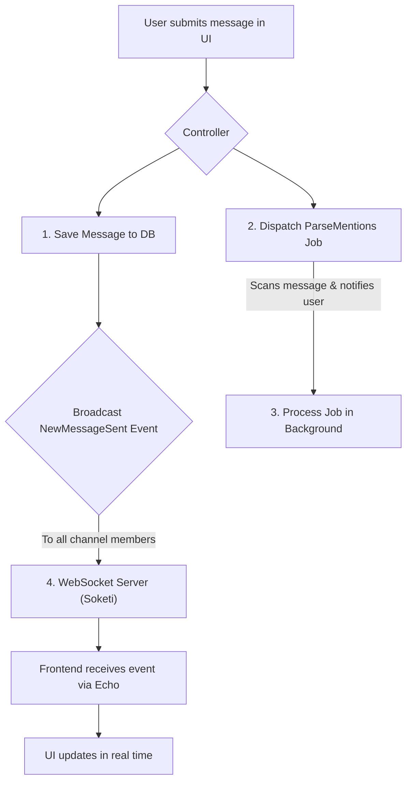
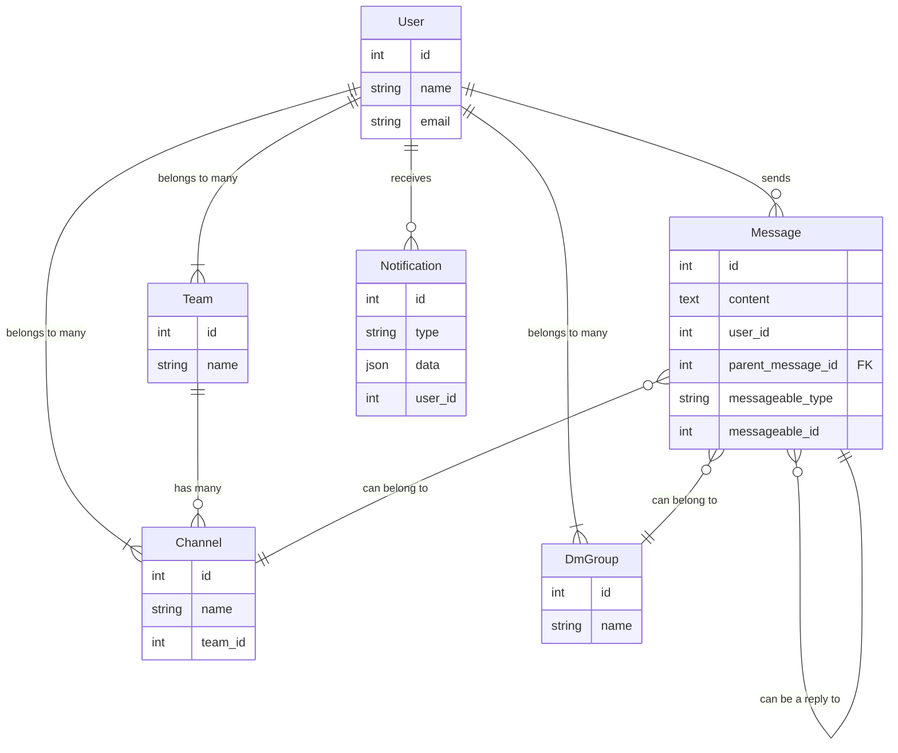

# Xlack Technical Documentation

## Introduction

Xlack is a real-time messaging platform inspired by Slack, built with Laravel 11, Vue 3, and Inertia.js. It provides a robust, scalable, and feature-rich environment for team communication, supporting channels, direct messages, threads, user mentions, and more — all delivered in real time via WebSockets.

## Latest changes (Nov 2025)

- Database and seeders:
    - New `AdminUserSeeder` ensures a default admin user exists: `admin@xlack.com` (password: `admin123`) with a personal team created automatically.
    - `DatabaseSeeder` now:
        - Creates a test user `test@example.com` with a personal team (password: `password`).
        - Creates the `#general` channel in the first available team, adds the test user, and posts a welcome message.
        - Runs `AdminUserSeeder` at the end of seeding.
- Threads (replies):
    - New migration `2025_11_11_153201_add_parent_message_id_to_messages_table.php` adds `parent_message_id` to the `messages` table to support threaded replies.
- Realtime/WebSockets and local environment:
    - `compose.yaml` now exposes port `8080` for Reverb (`${REVERB_PORT:-8080}:8080`).
    - New convenience scripts:
        - `start-services.sh`: starts Reverb and the Queue Worker inside the container (as the `sail` user).
        - `restart-all.sh`: restarts Docker containers and then starts internal services.
    - Relevant local ports: App `http://localhost`, Reverb `http://localhost:8080`, Soketi `http://localhost:6001`.

- Dashboard/Sidebar:
    - Fixed a bug where the sidebar showed all channels as `#general` when the user belonged to multiple teams. The dashboard channel list is now filtered by the active team, and the active-channel query is restricted to that team as well.
    - How to verify: switch teams (or ensure you belong to more than one team each with a `#general` channel) and confirm the sidebar only shows channels for the current team with the correct names.

## Key Objectives

- **Develop a modern, real-time messaging application:** Build a platform for seamless team communication with instant message delivery.
- **Support core collaboration features:** Implement essential functionalities like teams, channels, direct messages, threads, and user mentions.
- **Ensure a scalable and robust architecture:** Utilize Laravel's backend capabilities, including queues for background processing and events for broadcasting.
- **Deliver a fluid Single-Page Application (SPA) experience:** Use Vue.js and Inertia.js to create a responsive and interactive user interface without full page reloads.

## Use Cases

- **Team Collaboration:** Users can create or join teams to organize conversations and workflows.
- **Topic-Based Discussions:** Within a team, users can create public or private channels for specific topics.
- **Private Conversations:** Users can engage in one-on-one or small group conversations through Direct Messages (DMs).
- **Real-Time Messaging:** Messages are sent and received instantly without needing to refresh the page.
- **User Mentions:** Users can notify specific colleagues by mentioning them with `@username`, triggering a notification.
- **Threaded Replies:** Users can reply to specific messages, creating organized threads to keep conversations focused.
- **Simulated Video Calls:** Users can initiate a simulated video call from any chat window.

---

### High-Level Solution

Xlack is designed as a monolithic application with a Single-Page Application (SPA) frontend. Laravel serves as the backend API, while Inertia.js acts as a bridge to a Vue.js frontend, providing a seamless user experience.

- **Backend:** A standard Laravel application handles authentication, data persistence (MariaDB), and business logic.
- **Frontend:** Vue.js components render the UI, managed by Inertia.js, which receives data directly from Laravel controllers.
- **Real-Time Layer:** Laravel Echo, connected to a Soketi server, listens for broadcasted events (like new messages or notifications) and updates the UI in real-time.
- **Background Processing:** Heavy or non-blocking tasks, such as parsing user mentions in a new message, are offloaded to a Redis-backed queue.

### Flow Diagram: Message Sending

This diagram illustrates the flow of a message from submission to real-time delivery.



### Entity Diagram



---

## Epics and Tasks

This is the high-level implementation plan used for Xlack, structured as Epics and Tasks:

- **Epic 1: Project Setup & Auth**
    - Task 1: Initialize Laravel, Sail, and Jetstream (Teams).
    - Task 2: Configure MariaDB, Redis, and Soketi.
    - Task 3: Set up Inertia.js, Vue 3, and TailwindCSS.
    - Task 4: Implement basic authentication and team switching.

- **Epic 2: Channels & DMs**
    - Task 1: Implement Channel CRUD (create, list, join).
    - Task 2: Implement Direct Messages (DMs) between users.
    - Task 3: Build the sidebar for channel and DM navigation.

- **Epic 3: Real-Time Messaging**
    - Task 1: Create Message model, controller, and database schema.
    - Task 2: Configure real-time broadcasting with Echo & Soketi.
    - Task 3: Develop the message input and display UI components.

- **Epic 4: Mentions & Notifications**
    - Task 1: Implement logic to parse `@mentions` in messages.
    - Task 2: Create a notification system (database and broadcast channels).
    - Task 3: Use a background job to handle mention parsing asynchronously.

- **Epic 5: Threads (Replies)**
    - Task 1: Adapt the `messages` table to support threaded replies (`parent_message_id`).
    - Task 2: Develop the thread modal and UI for viewing replies.
    - Task 3: Create API endpoints for fetching and creating thread replies.

- **Epic 6: Simulated Video Calls**
    - Task 1: Design and build the video call modal UI.
    - Task 2: Integrate the call initiation button into the chat window.
    - Task 3: Simulate call events in the UI (no real WebRTC integration).

- **Epic 7: Polish & Documentation**
    - Task 2: Implement scripts or commands for cleaning demo data.
    - Task 3: Write a comprehensive technical README.

---

## Technical Stack
- **Backend:** PHP 8.2+, Laravel 11, Laravel Sail (Docker), MariaDB, Redis
- **Frontend:** Vue 3, Inertia.js, TailwindCSS
- **Realtime:** Laravel Echo, Soketi/Pusher
- **Authentication:** Jetstream (Inertia, Teams)

## Installation and Setup

1. **Clone the repository:**
	```bash
	git clone https://github.com/alexisbanda/xlack.git
	cd xlack
	```
2. **Copy and edit the environment file:**
	```bash
	cp .env.example .env
	# Edit variables if needed (ports, DB, broadcasting)
	```
    Minimal .env settings for local development with Sail + Soketi:

   ```dotenv
   APP_NAME=Xlack
   APP_URL=http://localhost

   # Database
   DB_CONNECTION=mysql
   DB_HOST=mariadb
   DB_PORT=3306
   DB_DATABASE=xlack
   DB_USERNAME=sail
   DB_PASSWORD=password

   # Queues
   QUEUE_CONNECTION=database

    # Broadcasting via Soketi (Pusher protocol)
    # Note: server (Laravel) talks to Soketi via docker network hostname 'soketi'.
    BROADCAST_CONNECTION=pusher
    PUSHER_APP_ID=xlack
    PUSHER_APP_KEY=app-key
    PUSHER_APP_SECRET=app-secret
    PUSHER_APP_CLUSTER=mt1
    PUSHER_HOST=soketi
    PUSHER_PORT=6001
    PUSHER_SCHEME=http

    # Frontend (Echo / Pusher)
   VITE_PUSHER_APP_KEY=${PUSHER_APP_KEY}
   VITE_PUSHER_APP_CLUSTER=${PUSHER_APP_CLUSTER}
    # Browser connects via localhost port mapping
    VITE_PUSHER_HOST=localhost
   VITE_PUSHER_PORT=${PUSHER_PORT}
   VITE_PUSHER_SCHEME=${PUSHER_SCHEME}

   # Reverb (optional if you prefer Laravel Reverb)
   # REVERB_APP_ID=xlack
   # REVERB_APP_KEY=reverb-key
   # REVERB_APP_SECRET=reverb-secret
   # REVERB_HOST=localhost
   # REVERB_PORT=8080
   # REVERB_SCHEME=http
   ```
3. **Install dependencies and start services:**
	```bash
	./vendor/bin/sail up -d
	./vendor/bin/sail composer install
	./vendor/bin/sail npm install
	```
4. **Generate app key:**
	```bash
	./vendor/bin/sail artisan key:generate
	```
5. **Run database migrations:**
	```bash
	./vendor/bin/sail artisan migrate
	```
6. **(Optional) Seed example data (recommended for local development):**
	```bash
	./vendor/bin/sail artisan db:seed
	```
7. **Build frontend assets or run dev server:**
    - Build once (production):
        ```bash
        ./vendor/bin/sail npm run build
        ```
    - Dev server with HMR (recommended while developing):
        ```bash
        ./vendor/bin/sail npm run dev
        ```
8. **Start background workers (choose one):**
    - Option A — Convenience script (recommended):
        ```bash
        ./start-services.sh
        ```
    - Option B — Manual commands:
        - **Queue worker:**
            ```bash
            ./vendor/bin/sail artisan queue:work --queue=default --tries=1
            ```
        - **WebSocket server (Reverb):**
            ```bash
            ./vendor/bin/sail artisan reverb:start --host=0.0.0.0 --port=8080
            ```
9. **Access the app:**
    - App: http://localhost
    - Reverb WebSocket: http://localhost:8080
    - Soketi (metrics): http://localhost:6001

### Demo users and seeded data

Running `db:seed` creates:
- Test user: `test@example.com` / password: `password`
- Admin user: `admin@xlack.com` / password: `admin123`

Additionally, the `#general` channel is created in the first available team, a welcome message is posted, and the test user is added to that channel.

To recreate data: `./vendor/bin/sail artisan migrate:fresh --seed`

### Useful scripts

- `./start-services.sh`
    - Ensures containers are up, stops any previous Reverb/Queue processes, fixes permissions for `storage` and `bootstrap/cache`, and starts:
        - Reverb at `0.0.0.0:8080`
        - Queue worker via `queue:work` (queue `default`, `--tries=1`)
    - Shows the status of containers and active processes.

- `./restart-all.sh`
    - Restarts the Docker Compose containers and then runs `start-services.sh`.
    - Useful when you changed `compose.yaml` or need to reset the services state.

---

**Developed by Christian Banda.**
